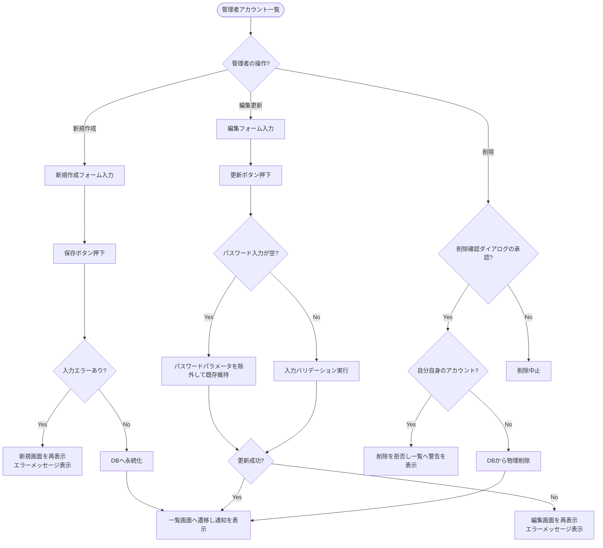

# 管理者アカウント管理 (CRUD) 基本設計書

システムを管理する「管理者アカウント」の追加・編集・一覧表示・削除を管理するための外部仕様（What）を定義します。

---

## 1. アクターとユースケース

*   **アクター**: 管理者
*   **ユースケース**:
    *   システムを共同管理する他の管理者アカウントを一覧で確認する。
    *   新たな管理者（メールアドレス・パスワード）を追加する。
    *   既存の管理者のメールアドレスやパスワードを更新する。
    *   不要になった他の管理者のアカウントを削除する（セキュリティ維持のため、ログインしている自分自身のアカウントの削除はシステムによって拒否されます）。

---

## 2. チェックポイントと業務フロー

管理者アカウント処理の際、システムは以下のビジネス上のチェックポイントを検証します。

1.  **管理者権限チェック**: アクセス者がログイン済みの管理者であること。
2.  **自己削除防止チェック**: 削除対象のアカウントが、現在ログインしている管理者自身（`current_admin`）ではないこと。自分自身のアカウントは削除をブロックします。
3.  **パスワード入力なし更新の許容**: メールアドレスのみを変更したいなどの場合に、パスワード欄を空欄のまま送信してもエラーとせず、既存のパスワードを維持して保存できるようにすること。

### 業務フロー

---

## 3. 画面の振る舞いとユーザーへのフィードバック

### 画面の状態変化

*   **管理者アカウント一覧画面 (`/admin/admins`)**:
    *   登録されている管理者のメールアドレスと登録日時がテーブル形式でリスト表示される。
    *   テーブルのヘッダーをクリックして「メールアドレス」「作成日時」で昇順・降順ソートができる。
    *   詳細画面 (`show`) は存在しないため、一覧画面上に「編集」および「削除」の操作用ボタンが直接配置される。
*   **新規登録・編集フォーム画面**:
    *   **入力フォーム項目**:
        *   メールアドレス（テキスト入力）
        *   新しいパスワード（パスワード入力）
        *   パスワードの確認（パスワード入力）
    *   **エラー発生時**:
        *   メールアドレスの形式が不正、既存アドレスと重複、またはパスワードとパスワードの確認内容が一致しない場合に保存を押すと、画面が遷移せずにフォーム画面が再描画され、「メールアドレスはすでに存在します」「パスワードの入力が一致しません」などの赤いバリデーションメッセージが表示される。
*   **削除実行時の挙動**:
    *   一覧画面の「削除」ボタンを押すと、ブラウザ上に「本当に削除しますか？」と警告ダイアログが表示される。
    *   他の管理者アカウントであれば正常に物理削除され、一覧画面上部に「管理者を削除しました」という緑色の通知が表示される。
    *   ログイン中の管理者自身（自分のアカウント）の削除ボタンを押した場合、処理が中断され、一覧画面上部に「自分自身は削除できません」という赤色のアラートが表示される。
