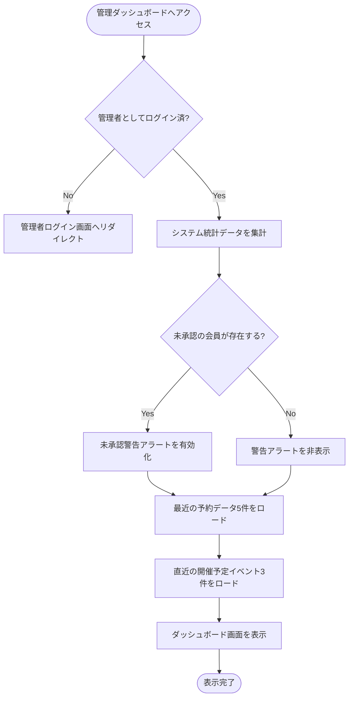

# 管理ダッシュボード 基本設計書

管理者がシステムの運用ステータス（登録数、今後のスケジュール、最近のアクティビティ）を俯瞰するための外部仕様（What）を定義します。

---

## 1. アクターとユースケース

*   **アクター**: 管理者
*   **ユースケース**: 管理画面へログインし、システム稼働情報（イベント数、予約数、会員登録数）を一元的に確認・把握する。また、新規イベントの作成画面や会員承認画面へのクイックリンクを利用する。

---

## 2. チェックポイントと業務フロー

ダッシュボード表示の際、システムは以下のビジネス上のチェックポイントを検証します。

1.  **管理者認証チェック**: アクセス者が「管理者アカウント」でログインしていること（未ログインの場合は管理ログイン画面へリダイレクト）。
2.  **承認待ちメンバーの検知**: 一般ユーザーの中に、登録したものの管理者からまだ「承認」されていないユーザーが存在するかを検出すること。

### 業務フロー

---

## 3. 画面の振る舞いとユーザーへのフィードバック

### 画面の状態変化

*   **未承認ユーザーの存在時（警告バナー）**:
    *   画面の最上部にオレンジ色の警告バナーが点滅（アニメーション）表示される。
    *   バナー内に「承認待ちのユーザーが ○ 名います」と表示され、「会員一覧へ」の遷移ボタンが設置される。
    *   未承認ユーザーが0名の場合は、このバナーは表示されない。
*   **統計ダッシュボードカード (Stats Cards)**:
    *   3つの主要指標が大きな文字とアイコンで視覚的にカード表示される。
        *   **登録会員数**: システム内の総ユーザー登録数。
        *   **イベント総数**: システムに登録されている全てのイベント（下書き・非公開含む）の総数。
        *   **予約総数**: これまでに登録されたすべての申込レコードの総数。
*   **直近の申込アクティビティ (Recent Bookings)**:
    *   直近に申し込まれた予約履歴が最新5件、時系列でリスト表示される。
    *   各行には「申込者のLINE名・アイコン画像」「イベント名」「申込が行われた時間（〜分前など）」が表示される。
*   **今後のイベントスケジュール (Upcoming Events)**:
    *   本日以降に開催予定のイベントが直近3件までカード表示される。
    *   カード内にはイベント名、カテゴリー、日時、場所に加え、予約充足度（現在の予約数 / 定員）を示すプログレスバーが視覚的に表示される。
    *   カード全体をクリックすると、該当イベントの管理者用詳細・管理画面へ直接遷移できる。
*   **クイックアクション**:
    *   ヘッダー右側に「新規イベント作成」ボタンが配置され、いつでも即座に作成画面に遷移できる。
*   **表示データの不在**:
    *   最近の予約や今後の予定が1件もない場合、リストの代わりに「直近の申込はありません」「今後のイベントはありません」というテキストがグレーアウト表示される。
