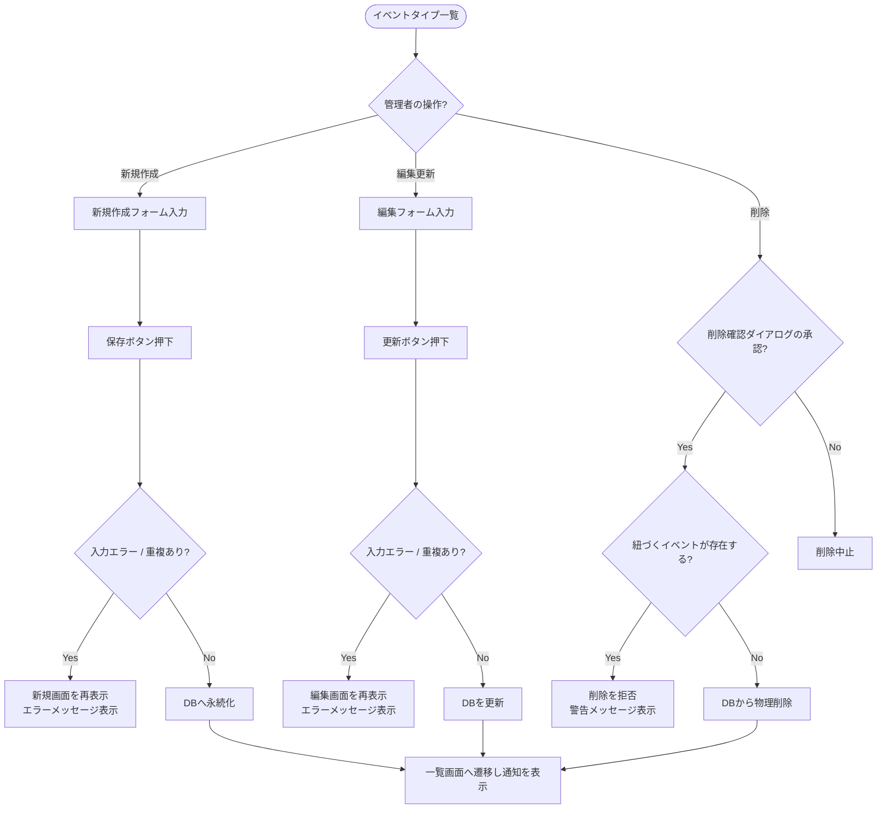

# イベントタイプ管理 (CRUD) 基本設計書

管理者がイベントを分類するためのカテゴリー（イベントタイプ）情報（新規作成、編集、一覧、削除）を管理するための外部仕様（What）を定義します。

---

## 1. アクターとユースケース

*   **アクター**: 管理者
*   **ユースケース**:
    *   イベントタイプ（カテゴリー名）の一覧を登録順・名前順で並び替えて確認する。
    *   イベントの分類に必要な「カテゴリー名」を新規登録・更新する。
    *   不要になったカテゴリーを削除する（ただし、該当カテゴリーに紐づいているイベントが存在する場合は削除が制限されます）。

---

## 2. チェックポイントと業務フロー

イベントタイプ処理の際、システムは以下のビジネス上のチェックポイントを検証します。

1.  **管理者権限チェック**: アクセス者が管理者アカウントで認証されていること。
2.  **イベントタイプ重複チェック**: 同名のカテゴリー名は二重登録できないこと。
3.  **イベント紐づきチェック（削除制限）**:
    *   削除を試みたイベントタイプに対して、1つでも割り当てられているイベントが存在する場合、データの整合性を維持するため削除を拒否し、例外（外部キー制約違反など）を発生させるかブロックすること。

### 業務フロー

---

## 3. 画面の振る舞いとユーザーへのフィードバック

### 画面の状態変化

*   **イベントタイプ一覧画面 (`/admin/event_types`)**:
    *   登録されているイベントタイプがテーブル形式でリスト表示される（デフォルトは作成日時の降順）。
    *   テーブルヘッダーをクリックすることで「名前」「作成日時」による昇順・降順のソート切り替えができる。
    *   本機能には詳細表示画面 (`show`) は存在しないため、一覧画面上に「編集」および「削除」の操作用ボタンが直接配置される。
*   **新規登録・編集フォーム画面**:
    *   **入力フォーム項目**:
        *   カテゴリー名（テキスト入力）
    *   **エラー発生時**:
        *   名前が空欄である場合、またはすでに同じ名前のカテゴリーが登録されている場合に保存を押すと、画面が遷移せずにフォーム画面が再描画され、「名前を入力してください」または「名前はすでに存在します」などの赤いバリデーションメッセージが表示される。
*   **削除実行時の挙動**:
    *   一覧画面の「削除」ボタンを押すと、ブラウザ上に「本当に削除しますか？」と警告ダイアログが表示される。
    *   対象のイベントタイプに紐づくイベントが存在しない場合は正常に物理削除され、一覧画面上部に「イベントタイプを削除しました」という緑色の通知が表示される。
    *   紐づくイベントが存在する場合、削除処理がエラーとなり、画面上部に「このイベントタイプは削除できません（イベントで使用されています）」等のエラー通知が表示され、削除がブロックされる。
