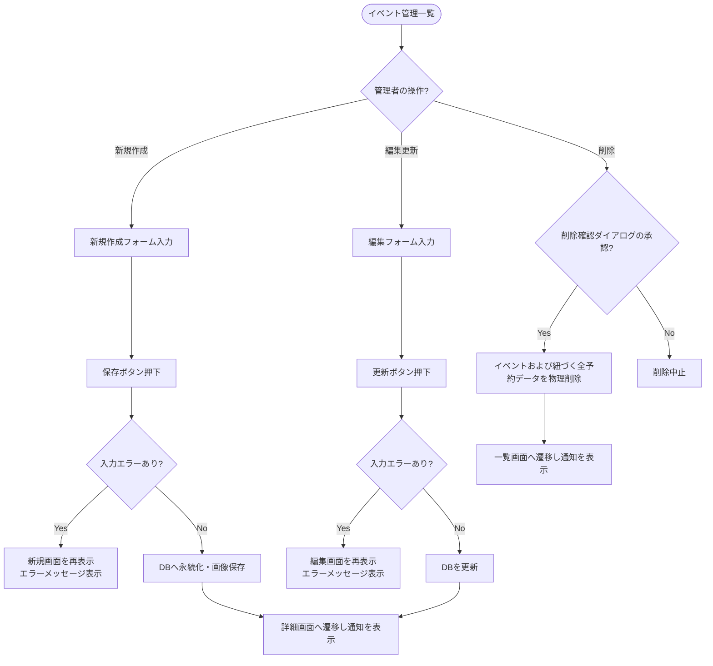

# イベント管理 (CRUD) 基本設計書

管理者がシステム内のイベント情報（新規作成、編集、一覧検索、詳細表示、削除）を管理するための外部仕様（What）を定義します。

---

## 1. アクターとユースケース

*   **アクター**: 管理者
*   **ユースケース**:
    *   開催予定または過去のイベントを一覧で検索・ソートして確認する。
    *   イベントの定員、開催日時、場所、および公開ステータス（下書き・公開・非公開）を登録・変更する。
    *   イベント詳細画面から、そのイベントに対する会員の予約申込者一覧を確認する。
    *   不要になったイベントを削除する（イベントに紐づく予約データも連動して物理削除される）。

---

## 2. チェックポイントと業務フロー

イベント管理処理の際、システムは以下のビジネス上のチェックポイントを検証します。

1.  **管理者権限チェック**: アクセス者が管理者アカウントで認証されていること。
2.  **イベント入力検証（バリデーション）**:
    *   タイトル、開催日時、カテゴリー（イベントタイプ）、定員数がすべて入力されていること。
    *   定員数は「1以上の整数」であること。
3.  **カスケード物理削除**: イベントが削除された場合、そのイベントに関連付けられている予約（Booking）データも同時にすべて自動削除（物理削除）されること。

### 業務フロー

---

## 3. 画面の振る舞いとユーザーへのフィードバック

### 画面の状態変化

*   **イベント一覧画面 (`/admin/events`)**:
    *   イベントがテーブル形式でリスト表示される（デフォルトは開催日時の降順）。
    *   テーブルのヘッダーをクリックすることで「タイトル」「開催日時」「作成日時」「定員」「ステータス」による昇順・降順のソート切り替えができる。
    *   検索フォームより「キーワード（タイトル部分一致）」「開催日」「ステータス（下書き/公開/非公開）」「空き枠数」による複合絞り込みができる。
    *   ページネーションにより1ページあたり5件で表示される。
*   **イベント詳細画面 (`/admin/events/:id`)**:
    *   イベントの全情報と、現在アタッチされている画像が表示される。
    *   画面下部には、そのイベントに予約を入れている一般メンバーの名前、LINEアバター画像、および「予約日時（○分前など）」が最新順の一覧リストで表示される。
*   **新規登録・編集フォーム画面**:
    *   **入力フォーム項目**:
        *   タイトル（テキスト入力）
        *   イベントカテゴリー（ドロップダウン選択）
        *   定員（数値入力、デフォルトは空）
        *   開催日時（日付・時間選択）
        *   開催場所（テキスト入力）
        *   公開ステータス（下書き / 公開 / 非公開 の3択）
        *   カバー画像（ActiveStorageによるファイルアップロード）
    *   **エラー発生時**:
        *   入力に不足や不正（例: 定員が0やマイナス）がある状態で保存を押すと、画面が遷移せずにフォーム画面が再描画され、該当する入力フィールドのそばに「タイトルを入力してください」「定員は1以上の値にしてください」などの赤いバリデーションメッセージが表示される。
*   **削除実行時の挙動**:
    *   一覧または詳細画面の「削除」ボタンを押すと、ブラウザ上に「本当に削除しますか？」と警告ダイアログが表示される。
    *   承認すると物理削除が実行され、一覧画面へ遷移して画面上部に「イベントを削除しました」という緑色の通知Flashが表示される。
