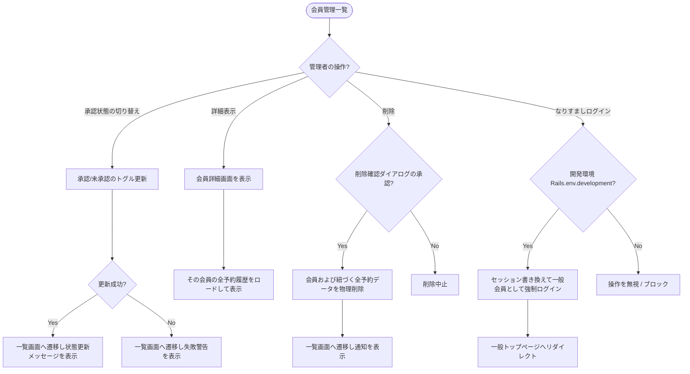

# 会員管理 基本設計書

管理者がLINEログインを介して登録された会員情報および承認状態、予約履歴を確認・変更・削除するための外部仕様（What）を定義します。

---

## 1. アクターとユースケース

*   **アクター**: 管理者
*   **ユースケース**:
    *   システムに登録されている全会員を一覧表示（ソート対応）で確認する。
    *   新規LINEログインユーザーを「承認（Approved）」してログイン可能にする。または既存ユーザーの承認を取り消し、ログインをブロックする。
    *   各会員の詳細画面から、その会員の過去・現在すべての予約申込履歴を確認する。
    *   不要になった会員レコードを削除する。
    *   【開発環境限定】指定した会員のアカウントで一般ユーザーとして本システムにログインし、ユーザー側の挙動を確認する（なりすましログイン）。

---

## 2. チェックポイントと業務フロー

会員管理処理の際、システムは以下のビジネス上のチェックポイントを検証します。

1.  **管理者権限チェック**: アクセス者が管理者アカウントで認証されていること。
2.  **承認状態反転（トグル処理）**: 承認ボタン押下により、現在が「承認」であれば「未承認」へ、現在が「未承認」であれば「承認」へ、ステータスを交互に切り替えられること。
3.  **カスケード予約削除**: 会員が削除された場合、その会員に関連付けられているすべての予約（Booking）データも同時に連動して物理削除されること。
4.  **環境制限（なりすまし）**: なりすましログイン機能は「開発環境（Development）」のみで有効とし、本番環境等では動作しないよう厳密に保護すること。

### 業務フロー

---

## 3. 画面の振る舞いとユーザーへのフィードバック

### 画面の状態変化

*   **会員一覧画面 (`/admin/users`)**:
    *   登録会員の名前、LINE画像、ログイン可否（承認状態）、および登録日時がテーブル形式でリスト表示される。
    *   テーブルのヘッダーをクリックして「名前」「承認状態」「登録日時」で昇順・降順ソートができる。
    *   承認欄にはトグルボタンが配置されており、クリックすると即座に承認フラグが反転し、「[会員名]のステータスを更新しました」とメッセージが表示される。
    *   【開発環境】各会員の行に「なりすましログイン」ボタンが表示され、クリックするとユーザーとしての検証ができる。
*   **会員詳細画面 (`/admin/users/:id`)**:
    *   対象会員のLINEプロフィール画像、ユーザー名、プロバイダー情報（LINE）、登録日時、および現在の承認状態が表示される。
    *   画面下部には、その会員がこれまでに予約したすべてのイベントの履歴（イベント名、開催日時、場所、および予約成立日時）が時系列リストで表示される。
*   **削除実行時の挙動**:
    *   一覧または詳細画面の「削除」ボタンを押すと、ブラウザ上に「本当に削除しますか？」と警告ダイアログが表示される。
    *   承認すると物理削除が実行され、一覧画面へ遷移して画面上部に「会員を削除しました」という緑色の通知Flashが表示される。
