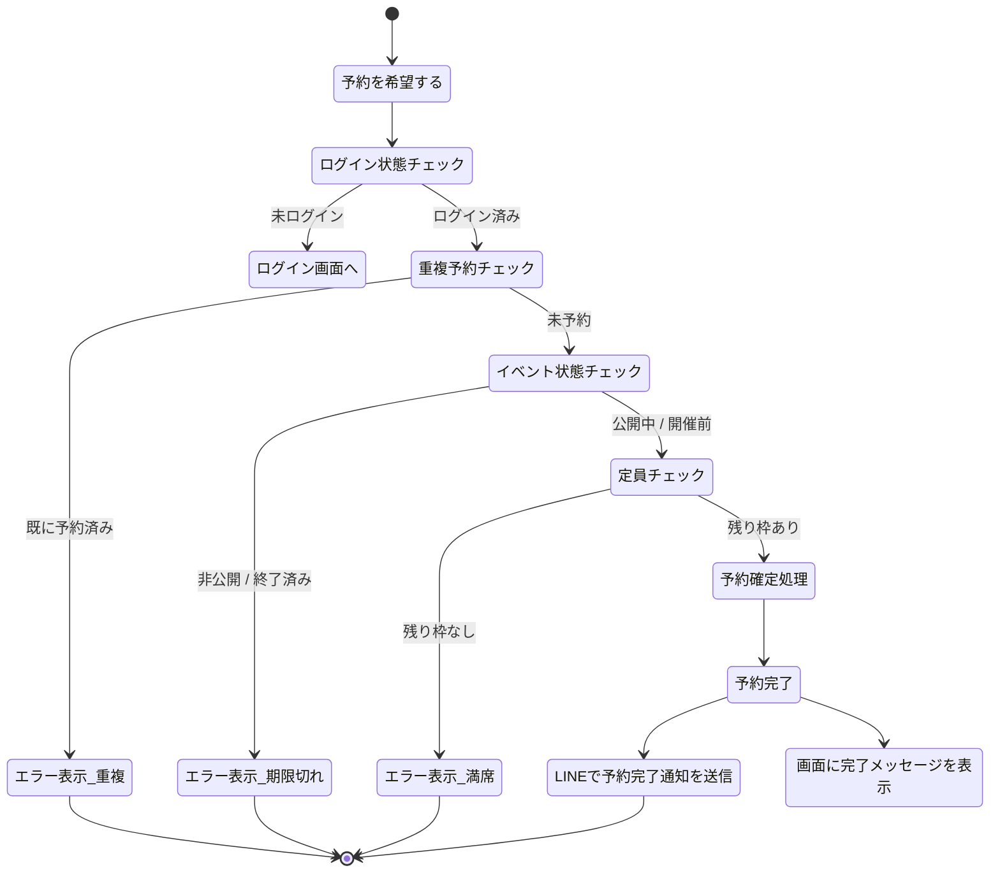

# 予約処理 基本設計書 (Booking)

一般メンバーがLINE経由でイベントへの参加（予約）を表明する処理の基本設計（外部設計）です。

## 1. アクターとユースケース

### アクター
*   **一般メンバー**: LINE公式アカウントからLIFFアプリを開いて操作するユーザー。

### ユースケース
*   イベント詳細画面から、対象イベントへの予約を行う。

---

## 2. 予約のチェックポイントと業務フロー

ユーザーが「予約する」を実行してから、予約が完了し通知が届くまでの業務フローです。システムは予約を受け付ける前に、以下のチェックポイントを検証します。

### 予約可否のチェックポイント
1.  **ログイン状態**: ユーザーが正常にLINEログインしていること。
2.  **重複予約チェック**: ユーザーが対象イベントを既に予約していないこと。
3.  **イベント状態チェック**: 対象イベントが「公開中」であり、開催日時が過去のものではないこと。
4.  **定員チェック**: 対象イベントの残り枠（定員 - 現在の予約数）が1以上であること。

### 業務フロー（アクティビティ図）

---

## 3. 画面の振る舞いとユーザーへのフィードバック

### 画面の状態変化
* **送信中**: 多重送信を防ぐため、予約ボタンは操作不可（処理中状態）になります。
* **成功時**: ボタンの表示が「予約済み」に切り替わり、再度押すことはできなくなります。画面上に「予約が完了しました。」という成功メッセージが表示され、最新の予約状況が画面に反映されます。
* **失敗時**: 画面上にエラーの理由（例：「定員に達しました」「既に予約されています」など）が表示され、ボタンは再び押せる状態（初期状態）に戻ります。

### LINE連携通知
* 予約が正常に完了した際、ユーザーのLINEアカウントへ予約内容（イベント名、日時、場所など）を記載したメッセージが自動送信されます。

