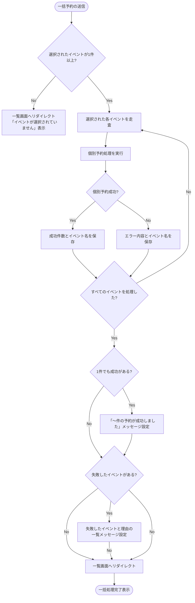

# 複数イベント一括予約処理 基本設計書

一般メンバーがカレンダーや一覧から複数のイベントを選択し、一括して予約登録を行うための外部仕様（What）を定義します。

---

## 1. アクターとユースケース

*   **アクター**: 一般メンバー（LINE認証済みユーザー）、管理者
*   **ユースケース**: カレンダーやイベント一覧画面から複数のイベントをまとめて選択し、1回のアクションで一括して予約を申し込む。

---

## 2. チェックポイントと業務フロー

一括予約の要求が発生した際、システムは以下のチェックを行います。

1.  **選択有無チェック**: 1つ以上のイベントが選択されていること（未選択時の実行はブロック）。
2.  **個別イベントバリデーション**: 一括処理の中の各イベントに対し、「ログインユーザーが未予約であること」「定員に達していないこと」を個別に検証します。
3.  **部分成否許容**: 複数のイベントのうち一部が満席等の理由で予約に失敗しても、他の正常な予約はロールバックせず成立させます。

### 業務フロー

---

## 3. 画面の振る舞いとユーザーへのフィードバック

### 画面の状態変化

*   **初期状態（一覧・カレンダー）**:
    *   画面下部の一括予約操作パネル（フローティングバー）は非表示（または透明で格納）状態。
*   **イベント選択時**:
    *   任意のイベントカードの左上にあるチェックボックスにチェックを入れると、画面下部からスライドインで黒い「一括予約フローティングバー」が表示される。
    *   バー上には「1件選択中」などの選択件数ラベルと、「一括で申し込む」ボタンが表示される。
    *   チェックを追加・解除するたびに、バー上の件数カウントがリアルタイムに同期更新される。
    *   選択がすべて解除されると、バーは再びスライドアウトして非表示になる。
*   **送信中（実行時確認）**:
    *   「一括で申し込む」ボタンを押下すると、ブラウザ標準の確認ダイアログ（「選択したイベントに一括で申し込みますか？」）が表示される。
    *   承認後、リクエストがサーバーへ送信される。
*   **処理完了時の画面フィードバック (部分成否の表示)**:
    *   **全件成功時**:
        *   イベント一覧画面へリダイレクトされ、緑色の「[イベント名1], [イベント名2] の予約が完了しました」という成功メッセージが画面上部に表示される。
    *   **一部失敗時（例: 3件中2件成功、1件満席によるエラー）**:
        *   リダイレクト後の画面上部に、緑色の「2件の申し込みが完了しました ([成功イベント1], [成功イベント2])」が表示され、
        *   同時に赤色のアラート領域に「【[失敗イベント3]】定員に達しているため申し込みできません」という具体的なエラーメッセージが表示される。
    *   **全件失敗時**:
        *   リダイレクト後の画面上部の赤色アラート領域に、すべてのイベントと失敗理由の一覧が表示される。
