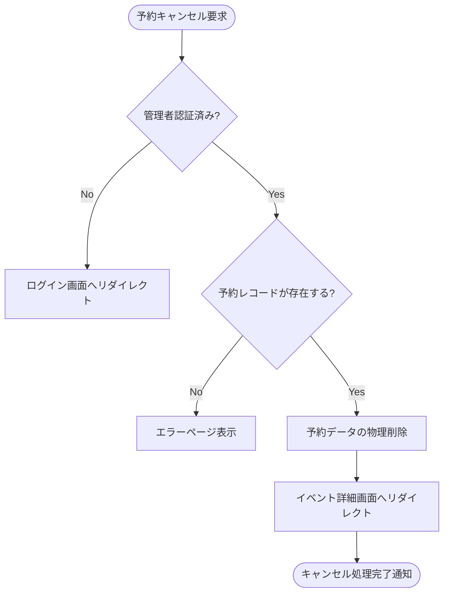

# 予約キャンセル処理 (管理者) 基本設計書

管理者によるイベント参加予約のキャンセル（削除）処理における外部仕様（What）を定義します。

---

## 1. アクターとユースケース

*   **アクター**: 管理者
*   **ユースケース**: 管理画面から、一般メンバーのイベント予約をキャンセル（削除）する。

---

## 2. チェックポイントと業務フロー

キャンセル要求が発生した際、システムは以下のビジネス上のチェックポイントを検証します。

1.  **認証チェック**: 要求者が「管理者」として認証されていること。
2.  **存在チェック**: キャンセル対象の予約データが存在すること。

### 業務フロー

---

## 3. 画面の振る舞いとユーザーへのフィードバック

### 画面の状態変化

管理画面のイベント詳細ページ内にある予約者一覧において、以下の状態変化が発生します。

*   **処理実行前**: 各予約者レコードの横に「キャンセル（削除）」ボタンが表示されている。
*   **送信中（実行指示後）**: ボタン押下時、ブラウザ標準の確認ダイアログ（「本当にキャンセルしますか？」）が表示される。承認後、リクエストがサーバーへ送信される（送信中はブラウザのローディング状態）。
*   **成功時**: リダイレクト後の画面（イベント詳細ページ）上部に「[ユーザー名]の予約をキャンセルしました」という通知メッセージ（Flash）が表示され、予約者一覧から該当ユーザーが消えている。
*   **失敗時（レコード未存在など）**: 標準のエラーページ（404 Not Found）が表示される。

### 外部連携通知

*   現時点の仕様では、キャンセルに伴う一般メンバーへの自動通知（LINEプッシュメッセージやメール）は行われません。
