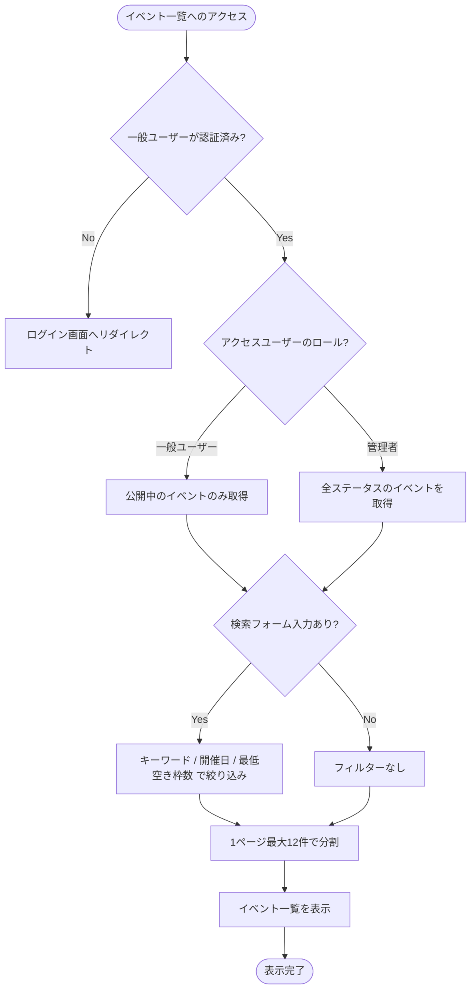

# イベント一覧表示処理 基本設計書

一般メンバーがシステム内で公開されているイベント情報を閲覧・検索するための外部仕様（What）を定義します。

---

## 1. アクターとユースケース

*   **アクター**: 一般メンバー（LINE認証済みユーザー）、管理者
*   **ユースケース**: 公開中イベントを検索し、一覧形式で閲覧する（管理者の場合は下書き等を含む全イベントが閲覧可能）。

---

## 2. チェックポイントと業務フロー

イベント一覧の表示または検索の際、システムは以下のビジネス上のチェックポイントを検証します。

1.  **認証チェック**: 一般メンバーからのアクセスの場合、LINE認証が完了していること。
2.  **公開状態フィルター**: 一般メンバーには「公開（published）」のイベントのみを表示し、「下書き（draft）」や「非公開（hidden）」のイベントは表示させないこと（管理者の場合は全ステータス表示）。
3.  **検索フィルター適用**: 検索フォームで指定された「キーワード」「開催日」「最低空き枠数」に合致するイベントのみを絞り込むこと。

### 業務フロー

---

## 3. 画面の振る舞いとユーザーへのフィードバック

### 画面の状態変化

*   **初期状態（一覧表示）**:
    *   開催日時の昇順でイベントカードがグリッド表示される。
    *   ヘッダー部分にはウェルカムメッセージとログイン中のユーザーアイコンが表示される。
    *   イベントごとに定員、開催日時、場所、および詳細画面へのリンクボタンが表示される。
*   **絞り込み実行中**:
    *   検索キーワード（タイトル部分一致）、開催日（日付）、または最低空き枠数を指定して「検索」を押下すると、画面がローディング状態となり、絞り込み結果に切り替わる。
    *   「リセット」ボタンを押下すると、検索条件がクリアされ初期状態に戻る。
*   **該当イベントなし**:
    *   絞り込みの結果、該当するイベントが1件も存在しない場合、「現在開催予定のイベントはありません」というメッセージおよびカレンダーアイコンが表示される。
*   **イベントの予約状態によるバッジ表示**:
    *   **申込済**: ログインユーザーが既にそのイベントを予約している場合、カード右上に緑色の「申込済」バッジが表示される（二重予約不可のため、一括予約のチェックボックスは非表示/無効化される）。
    *   **満席**: イベントの現在の予約数が定員に達している場合、カード右上にグレーの「満席」バッジが表示される（一括予約のチェックボックスは非表示/無効化される）。
*   **ページネーション遷移**:
    *   イベント数が12件を超える場合、下部にページ移動リンクが表示され、ページ遷移を行うことができる。
