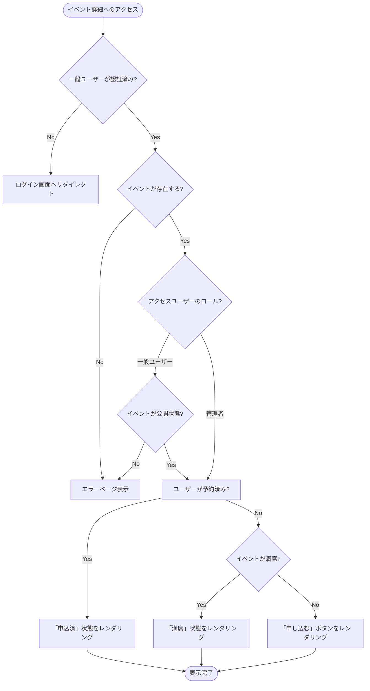

# イベント詳細表示処理 基本設計書

一般メンバーが特定のイベントの詳細情報を閲覧し、予約状態に応じたアクションを実行するための外部仕様（What）を定義します。

---

## 1. アクターとユースケース

*   **アクター**: 一般メンバー（LINE認証済みユーザー）、管理者
*   **ユースケース**: 特定のイベントの開催日時、場所、現在の申込人数・定員などの詳細情報を確認し、予約申込を行う。

---

## 2. チェックポイントと業務フロー

イベント詳細を表示する際、システムは以下のビジネス上のチェックポイントを検証します。

1.  **認証チェック**: 一般メンバーからのアクセスの場合、LINE認証が完了していること。
2.  **公開状態フィルター**: 一般メンバーには「公開（published）」のイベントのみを表示し、「下書き（draft）」や「非公開（hidden）」のイベントは表示させないこと（管理者の場合は全ステータス表示）。
3.  **予約ステータス判定**: ログインユーザーがすでにそのイベントに申し込んでいるかどうかを確認し、画面のアクションを切り替えること。

### 業務フロー

---

## 3. 画面の振る舞いとユーザーへのフィードバック

### 画面の状態変化

*   **初期状態（詳細情報の表示）**:
    *   画面上部にイベントタイトルとカテゴリーバッジが表示される。
    *   開催日時、場所、イベントの説明テキストが表示される。
    *   右側サイドバー（またはスマートフォン等では下部）に、現在の予約者数と定員数がプログレスバー付きで表示される。
*   **予約状態による右側サイドバー（アクション欄）の振る舞い**:
    *   **すでに予約済みの場合**:
        *   「申込済」というチェックマーク付きのカードが表示され、申し込みボタンは表示されない。
    *   **定員に達している場合（満席）**:
        *   「満席」という文言のグレーアウトされたカードが表示され、申し込みボタンは表示されない。
    *   **予約可能枠が残っている場合**:
        *   「申し込む」ボタンがアクティブ状態で表示される。
        *   ボタンを押下すると、画面上に確認メッセージ（「本当に申し込みますか？」）が表示される。
*   **プレビューモード（管理画面からの遷移）**:
    *   管理者がプレビュー目的でアクセスした場合（URLパラメータ `preview=true` 時）、申し込みボタンは半透明になり押下できない。
