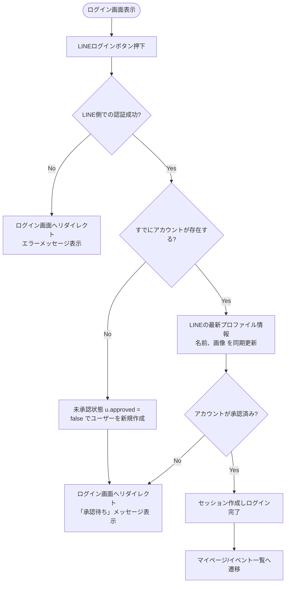

# LINEログイン認証処理 基本設計書

一般メンバーがシステムへログイン、またはサインアップ（自動アカウント作成）するための外部仕様（What）を定義します。

---

## 1. アクターとユースケース

*   **アクター**: 一般メンバー（LINEアカウントを所持しているユーザー）
*   **ユースケース**: LINEログインを利用して、本システムにサインイン、または新規アカウント登録を行う。

---

## 2. チェックポイントと業務フロー

LINEログイン要求が発生した際、システムは以下のビジネス上のチェックポイントを検証します。

1.  **外部連携トークン検証**: LINE側での認証が正常に完了し、プロファイル情報（UID、表示名、画像URL）が取得できること。
2.  **管理者承認ステータスチェック**: ログインを試みたユーザーが、管理者によって「承認（Approved）」されていること。未承認の新規ユーザーは、自動登録されるもののログイン自体は保留されます。

### 業務フロー

---

## 3. 画面の振る舞いとユーザーへのフィードバック

### 画面の状態変化

*   **ログイン前（ログイン画面）**:
    *   画面中央に「LINEでログイン」ボタンのみがシンプルに配置されている。
*   **認証実行中（LINE遷移時）**:
    *   ボタン押下後、LINEの外部認証ページにリダイレクトされる。ユーザーはLINEの画面上で権限を許可する。
*   **成功時（承認済みユーザー）**:
    *   ログイン成功後、会員のトップページ（イベント一覧やマイページなど）へ自動遷移する。
    *   画面上部に「LINEアカウントでログインしました」という通知メッセージ（Flash）が一時表示される。
*   **一時保留時（新規登録時 / 未承認ユーザー）**:
    *   ログイン画面（`/login`）へリダイレクトして戻される。
    *   画面上部に「管理者による承認待ちです。」というアラートメッセージ（Flash）が表示される。
*   **失敗時（LINE側でのキャンセルや通信エラー）**:
    *   ログイン画面（`/login`）へリダイレクトして戻される。
    *   画面上部に「ログインに失敗しました。」というアラートメッセージ（Flash）が表示される。
