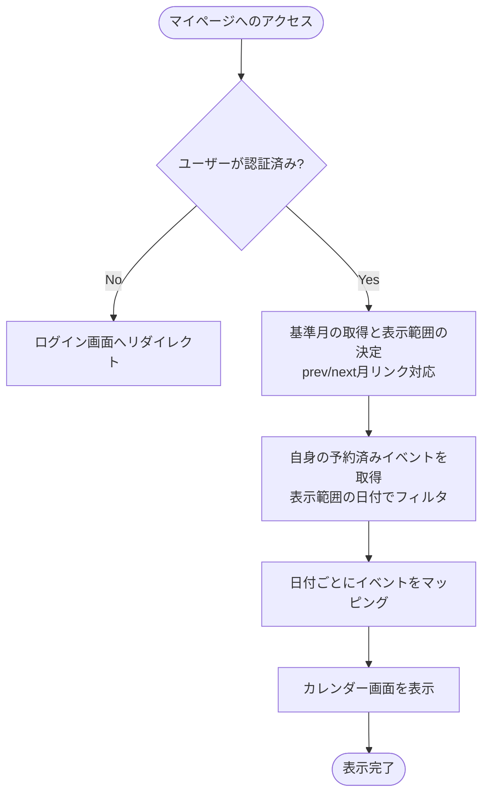

# 予約カレンダーマイページ 基本設計書

一般メンバーが自身が予約しているイベントの日程をカレンダー上で確認するための外部仕様（What）を定義します。

---

## 1. アクターとユースケース

*   **アクター**: 一般メンバー（LINE認証済みユーザー）
*   **ユースケース**: 自身の予約済みイベントの一覧を、カレンダー形式（月間）で視覚的に確認する。

---

## 2. チェックポイントと業務フロー

マイページを表示する際、システムは以下のビジネス上のチェックポイントを検証します。

1.  **認証チェック**: 要求者がログイン済みの一般メンバーであること。未ログインの場合はアクセスを拒否します。
2.  **自己データ制限**: 他のユーザーの予約情報は表示せず、ログイン中ユーザー自身（`current_user`）の予約情報のみを表示すること。
3.  **カレンダー日付境界**: 表示する月のカレンダーの「第1週の日曜日」から「最終週の日曜日」までの範囲にある予約データをもれなく抽出すること。

### 業務フロー

---

## 3. 画面の振る舞いとユーザーへのフィードバック

### 画面の状態変化

*   **初期状態（カレンダー表示）**:
    *   画面中央に月間のカレンダーグリッド（日曜日開始、土曜日終了）が表示される。
    *   ヘッダー部分には当月の「年・月」と、前月・翌月へ移動するための矢印ボタンが表示される。
    *   下部には凡例（「今日」「予約したイベント」のマーク説明）が表示される。
*   **カレンダーセルの表示仕様と配色ルール**:
    *   **今日の日付**: 日付の数字がインディゴの円で囲まれ白文字になり、最も強調して表示される。
    *   **土日・祝日/平日の色分け**:
        *   当月の日曜日・祝日はピンク色、土曜日は青色、平日は黒色で表示される。
        *   当月以外の日（前月末・翌月初）はグレーアウトされ、文字が半透明になる。
    *   **予約がある日**:
        *   セル全体が淡いインディゴ色に染まり、極薄の枠線で囲まれる。ホバーすると濃い色に変化し、クリック可能（詳細画面への遷移）であることが明示される。
*   **デバイスに応じた情報の最適化**:
    *   **パソコン等（大画面）**:
        *   カレンダーセル内に「10:00 [イベントタイトル]」のように、時間とタイトルが直接リスト表示される。タイトルをクリックすると該当イベントの詳細画面へ直接遷移できる。
    *   **スマートフォン（小画面）**:
        *   カレンダーセル内には青い「ドット（●）」のみが表示され、セルの高さを抑えて全体をコンパクトに収める。
        *   代わりに、カレンダーの下部に「今月の予定一覧」として、予約しているイベントが時系列で縦並びのリスト（開催日、曜日、時間、場所、タイトル）で自動表示される。リストをタップするとイベント詳細画面へ遷移する。
