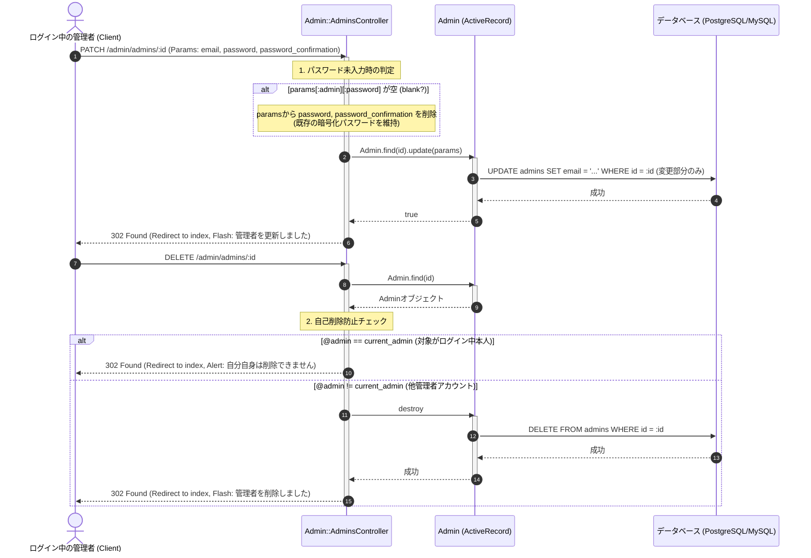

# 管理者アカウント管理 (CRUD) 詳細設計書

管理者による管理者アカウントCRUD処理、Deviseパスワード更新時のパラメータ制御および自己削除防止ガードの具体的な実装仕様を定義した詳細設計（内部設計）です。

---

## 1. 処理フローに沿った詳細仕様

リクエストの受信からレスポンス返却にいたるまでの時系列フローに沿って、各コンポーネントの処理詳細を定義します.



---

## 2. 各工程 of 具体的な実装設計

上記の時系列フローに対応する、具体的なクラスやDBの設定詳細です。

### 1. パスワード空送信時のパラメータ除外ロジック (工程 1)
Deviseの `validatable` は、パスワードがパラメータに含まれているとバリデーションを起動し、さらに値が空の場合は「パスワードを入力してください」というエラーを発生させます。
そのため、メールアドレスやその他設定のみを更新する際に不都合が生じるのを回避するために、コントローラー層で動的にパラメータを削除します。

```ruby
# app/controllers/admin/admins_controller.rb より抜粋
def update
  if params[:admin][:password].blank?
    # パスワードパラメータをハッシュから削除
    params[:admin].delete(:password)
    params[:admin].delete(:password_confirmation)
  end

  if @admin.update(admin_params)
    redirect_to admin_admins_path, notice: t("admin.notices.updated", model: Admin.model_name.human)
  else
    render :edit, status: :unprocessable_entity
  end
end
```
*   `params[:admin].delete(:password)` によって強制的にもとの値が維持され、データベースには `encrypted_password` をそのまま据え置く `UPDATE` クエリが発行されます。

### 2. ログイン中本人の自己削除防止ガード (工程 2)
本システムから全ての管理者が消失したり、操作している本人が誤って自身のアカウントを削除し管理権限を喪失するリスクを防ぐため、コントローラー層で防衛ロジックを実装します。

*   **比較条件**: `@admin == current_admin`
    *   `current_admin`: Deviseが提供するヘルパーであり、セッションに保存されているログイン中の管理者インスタンスを指します。
    *   `@admin`: `set_admin` でリクエストの `id` に基づきDBから検索された対象のインスタンス。
*   **挙動**:
    上記の条件が一致（本人の削除要求）した場合、`@admin.destroy` の実行処理をバイパス（スキップ）し、早期リターンでリダイレクト通知を送信します。

```ruby
# app/controllers/admin/admins_controller.rb より抜粋
def destroy
  if @admin == current_admin
    redirect_to admin_admins_path, alert: t("admin.notices.cannot_delete_self")
    return # 処理を中断
  end

  @admin.destroy
  redirect_to admin_admins_path, notice: t("admin.notices.destroyed", model: Admin.model_name.human)
end
```

### 3. パスワードのハッシュ化と一意性制約
*   **テーブル**: `admins`
*   **認証エンジン**: Devise
*   **パスワード保存形式**: bcrypt による一方向ハッシュ化 (`encrypted_password` 列に格納)。
*   **一意性制約**: メールアドレス重複ログインを避けるため、一意インデックスを物理設定。
    `add_index :admins, :email, unique: true`
*   **バリデーション**: Deviseの `validatable` モジュールにより、`email` のフォーマットと一意性、および `password` の最小・最大長さがモデルのセーブ時に自動的に検証されます。
