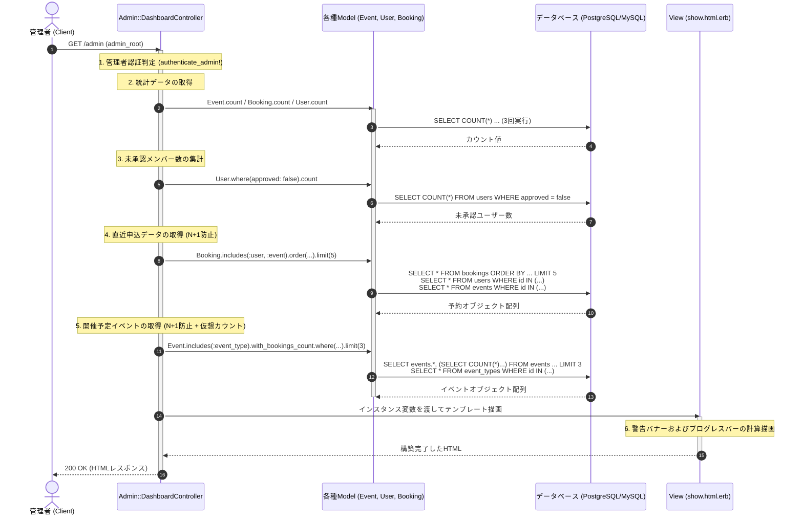

# 管理ダッシュボード 詳細設計書

管理ダッシュボード表示処理の具体的な実装仕様を定義した詳細設計（内部設計）です。

---

## 1. 処理フローに沿った詳細仕様

リクエストの受信からレスポンス返却にいたるまでの時系列フローに沿って、各コンポーネントの処理詳細を定義します。



---

## 2. 各工程 of 具体的な実装設計

上記の時系列フローに対応する、具体的なクラスやDBの設定詳細です。

### 1. 認証とコントローラー継承 (工程 1)
*   **認証フィルター**: `Admin::DashboardController` は `Admin::BaseController` を継承します。親クラスで定義されている `before_action :authenticate_admin!` に従い、未ログインのアクセスを検知すると管理者ログインページへリダイレクトします。
*   **レイアウト**: 管理者用の共通CSS/JSアセットを読み込むため、`layout "admin"` が自動的に適用されます。

### 2. 統計クエリとN+1問題の回避 (工程 2, 4, 5)
ダッシュボード画面では、システム上の複数モデルにまたがるデータを一度に読み込みますが、ページの描画速度を維持するため、以下のN+1対策を講じたクエリを発行します。

*   **直近の申込履歴**:
    ユーザー情報（アバター、名前）およびイベント情報を一覧表示するため、`includes` を用いてアソシエーションをあらかじめ一括ロードします。
    `Booking.includes(:user, :event).order(created_at: :desc).limit(5)`
*   **今後のイベントスケジュール**:
    イベントタイプ名と現在の申込状況（充足率のプログレスバー表示）を計算するため、`includes` と `with_bookings_count` スコープを組み合わせて、SQLのサブクエリ集計値ごと一挙にロードします。

```ruby
# app/controllers/admin/dashboard_controller.rb
@upcoming_events = Event.includes(:event_type)
                       .with_bookings_count
                       .where("held_at >= ?", Time.current)
                       .order(held_at: :asc)
                       .limit(3)
```

### 3. 未承認メンバー警告バナーの制御 (工程 3, 6)
新規登録されたLINEメンバーは未承認状態（`approved: false`）で保存されます。
*   **検出条件**: `@pending_users_count = User.where(approved: false).count`
*   **ビュー描画制御**: ビュー側で `@pending_users_count > 0` を判定し、1件以上存在する場合にのみ警告用のヘッダーアラート（HTML）を挿入します。

### 4. ビュー描画時の計算仕様 (工程 6)
*   **予約充足率 (Occupancy Rate)**:
    今後のイベントカードにおいて、予約充足率をプログレスバーの横幅（`%`）として出力するために、`event.occupancy_rate` メソッドを呼び出します。
    *   計算式: `(current_bookings_count.to_f / capacity * 100).round`
    *   ※ビュー側で上限を100%に丸めるための安全対策を施します：`[event.occupancy_rate, 100].min`
*   **経過時間の和訳**:
    直近の申込時間において、`time_ago_in_words(booking.created_at)` を用いて「3分前」「2時間前」などの親しみやすい時間表記にフォーマットします。
