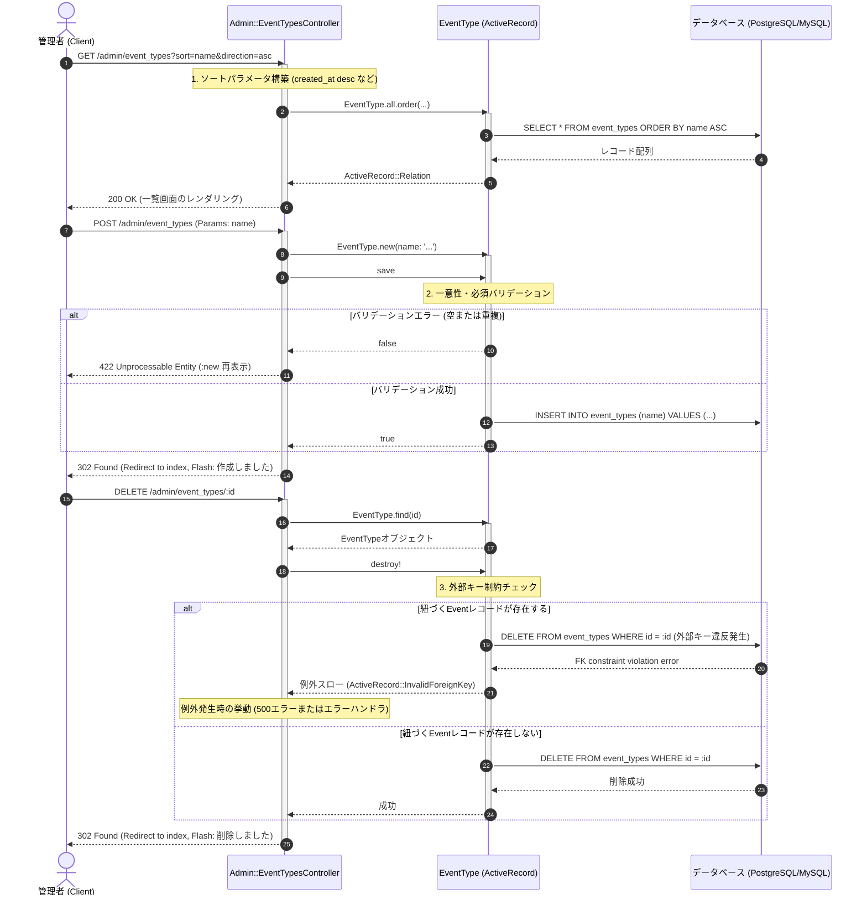

# イベントタイプ管理 (CRUD) 詳細設計書

管理者によるイベントタイプCRUD処理および一意性制約、削除制限に伴うエラーハンドリングの具体的な実装仕様を定義した詳細設計（内部設計）です。

---

## 1. 処理フローに沿った詳細仕様

リクエストの受信からレスポンス返却にいたるまでの時系列フローに沿って、各コンポーネントの処理詳細を定義します。

---

## 2. 各工程 of 具体的な実装設計

上記の時系列フローに対応する、具体的なクラスやDBの設定詳細です。

### 1. 検索・動的ソート処理 (工程 1)
*   **ホワイトリスト指定**:
    `AdminSortable` に基づき、ソート用のカラムホワイトリストを定義します。本機能では `name` と `created_at` のみを許可します。
    `s = sort_params("created_at", "desc", %w[name created_at])`
*   本一覧画面にはページネーション（Pagy）は適用されず、全件を1画面に表示します。

### 2. イベントタイプモデル・データベース設計 (工程 2)
*   **テーブル**: `event_types`
*   **バリデーション定義**:
    *   `name`: `presence: true, uniqueness: true`
    *   これにより、空白での登録および、大文字小文字を含め同一名称のカテゴリー重複登録がモデルレベルで阻止されます。
*   **一意性インデックス**:
    並行処理による重複データ保存を防ぐため、データベース物理レベルでも一意インデックスを構築します。
    `add_index :event_types, :name, unique: true`

### 3. 削除制限と例外ハンドリング (工程 3)
*   **カスケード設定なし**:
    `EventType` モデルでは、`has_many :events` アソシエーションに対して `dependent: :destroy` などのオプションを設定していません。
*   **データベース制約（外部キー）**:
    `events` テーブルの `event_type_id` カラムには、データベースレベルで外部キー制約（Foreign Key Constraint）が定義されています。
    `add_foreign_key :events, :event_types`
*   **挙動**:
    該当するイベントタイプが既存のイベント（Event）から参照されている状態で `destroy!` を実行すると、DB側で外部キー制約違反（Integrity Constraint Violation）が走り、ActiveRecordは `ActiveRecord::InvalidForeignKey` 例外を発生させます。
*   **エラーの通知**:
    本番環境においてこの例外が捕捉されない場合、標準の500エラー画面に遷移します。不整合を防ぐため、この強固なデータ保護ポリシーが維持されます。
