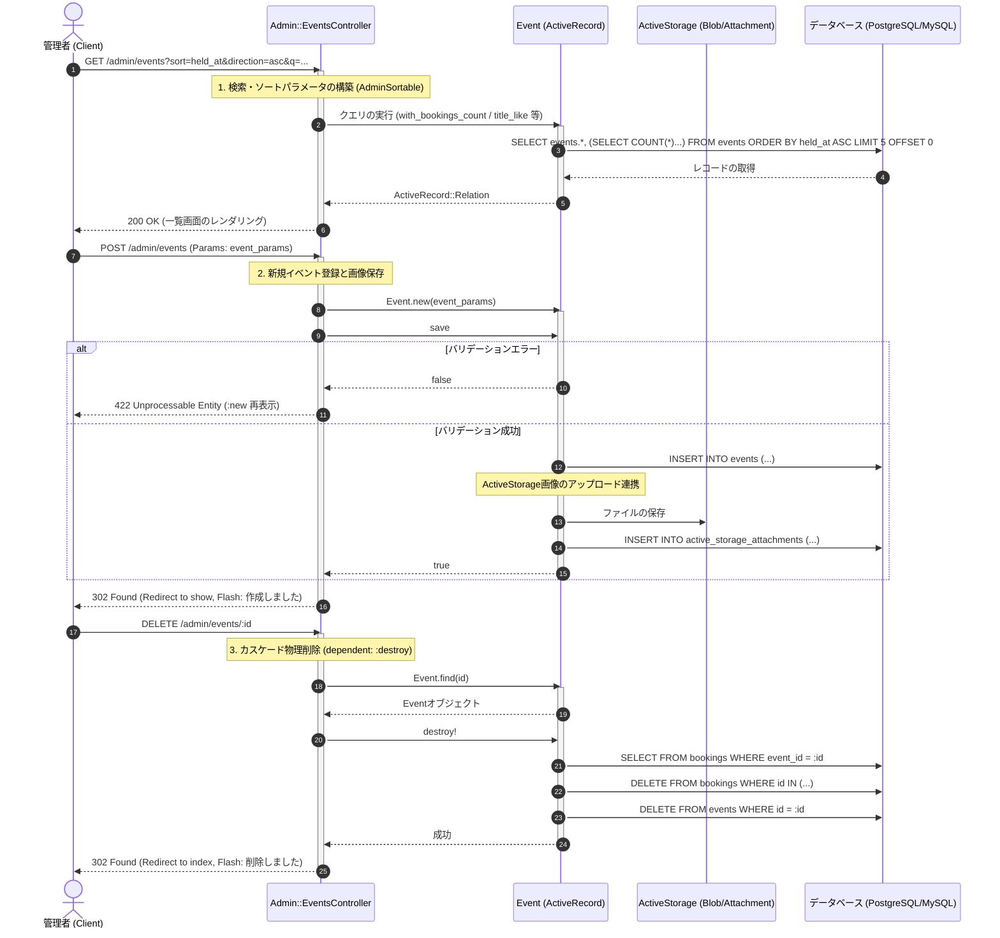

# イベント管理 (CRUD) 詳細設計書

管理者によるイベントCRUD処理および並べ替え・検索、ActiveStorage画像管理の具体的な実装仕様を定義した詳細設計（内部設計）です。

---

## 1. 処理フローに沿った詳細仕様

リクエストの受信からレスポンス返却にいたるまでの時系列フローに沿って、各コンポーネントの処理詳細を定義します。

---

## 2. 各工程 of 具体的な実装設計

上記の時系列フローに対応する、具体的なクラスやDBの設定詳細です。

### 1. 検索・動的ソート処理 (工程 1)
*   **ソートモジュール (`AdminSortable`)**:
    管理テーブル用の汎用的なソート機能をインクルードします。
    `s = sort_params("held_at", "desc", %w[title held_at created_at capacity status])`
    *   引数 1: デフォルトソート列 (`held_at`)
    *   引数 2: デフォルトソート順 (`desc`)
    *   引数 3: ソートを許可するカラムのホワイトリスト（指定外のカラム名インジェクションを防止）
*   **ページネーション (Pagy)**:
    一覧は1ページあたり `5` 件として制限を適用します。
    `@pagy, @events = pagy(:offset, @events.order("#{s[:column]} #{s[:direction]}"), limit: 5)`

### 2. イベントモデル・データベース設計 (工程 2)
*   **テーブル**: `events`
*   **アソシエーションと画像ストレージ**:
    *   `belongs_to :event_type`
    *   `has_one_attached :image` (ActiveStorageによる画像ファイルのバイナリ連携)
*   **公開ステータス (Enum)**:
    `enum :status, { draft: 0, published: 1, hidden: 2 }, default: :draft`
*   **バリデーション定義**:
    *   `title`, `held_at`, `status`, `event_type_id`: `presence: true` (空文字禁止)
    *   `capacity`: `presence: true, numericality: { only_integer: true, greater_than_or_equal_to: 1 }` (1以上の整数)

### 3. 画像ファイルの保存フロー (工程 2)
ストロングパラメータに `:image` が指定されている場合、ActiveStorageのミドルウェアが起動します。
1.  ローカルストレージ (またはS3等) にファイルバイナリを書き込み、`active_storage_blobs` にメタデータを保存。
2.  `active_storage_attachments` に `record_type: 'Event'`, `record_id: [event_id]`, `name: 'image'` としてレコードをインサート。

### 4. カスケード物理削除仕様 (工程 3)
*   **関連テーブル連携**: 
    イベントが削除されるとき、予約が入ったまま削除されることによる不整合を防ぐため、モデルアソシエーションでカスケード削除を定義します。
    `has_many :bookings, dependent: :destroy`
*   これにより、`event.destroy!` が実行されると、ActiveRecordのライフサイクルフックが作動し、該当イベントに関連する `bookings` レコードに対して順次 `DELETE` クエリが走った後、`events` レコードが物理削除されます。
