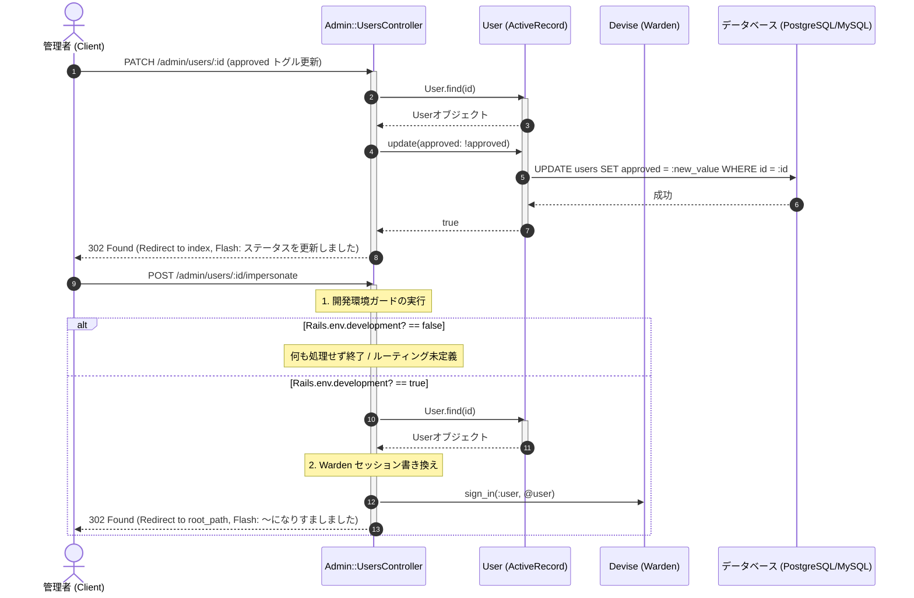

# 会員管理 詳細設計書

管理者による会員承認、詳細履歴の取得、なりすましログイン（開発環境限定）およびカスケード削除の具体的な実装仕様を定義した詳細設計（内部設計）です。

---

## 1. 処理フローに沿った詳細仕様

リクエストの受信からレスポンス返却にいたるまでの時系列フローに沿って、各コンポーネントの処理詳細を定義します。



---

## 2. 各工程 of 具体的な実装設計

上記の時系列フローに対応する、具体的なクラスやDBの設定詳細です。

### 1. 承認フラグのトグル切り替え (工程 1)
*   **エンドポイント**: `PATCH /admin/users/:id`
*   **トグルロジック**: 
    コントローラー内部で、対象レコードの現在の `approved` 状態（ブーリアン）をロードし、エクスクラメーション（`!`）演算子を用いて反対値でデータベースを直接アップデートします。
    `@user.update(approved: !@user.approved)`
*   **リダイレクト制御**:
    更新完了後、`admin_users_path` へ戻し、更新結果の通知メッセージを設定します。
*   **未承認化時のログイン拒否連動**:
    前述の `User` モデルに定義された `active_for_authentication?` オーバーライドにより、承認トグルを `false` に切り替えられたユーザーは、次回以降（またはセッション更新のタイミングで）ログイン画面へ弾かれます。

### 2. 開発環境限定なりすましログイン (工程 2)
本機能は開発および動作確認の効率化のために実装されていますが、本番環境への流出を確実に防ぐため、二重のガードを適用しています。

*   **ルーティングレベルでのガード**: `config/routes.rb`
    `post :impersonate, on: :member if Rails.env.development?`
    これによって、テストや本番環境（`production` / `test`）ではそもそもAPIルート自体が定義されず、アクセスすると `ActionController::RoutingError` (404) となります。
*   **コントローラーレベルでのガード**: `app/controllers/admin/users_controller.rb`
    ```ruby
    def impersonate
      return unless Rails.env.development? # 安全弁としてのガード
      @user = User.find(params[:id])
      sign_in(:user, @user) # Devise認証セッションへの割り込み
      redirect_to root_path, notice: t("admin.notices.impersonated", name: @user.name || @user.email)
    end
    ```
*   `sign_in(:user, @user)` を用いて一般ユーザーのセッション（Wardenスコープ）を管理セッションを残したまま強制的に上書き確立し、一般トップページへ遷移させます。

### 3. 会員削除時の予約レコード自動クリーンアップ
*   **依存関係**: `app/models/user.rb`
    `has_many :bookings, dependent: :destroy`
*   **挙動**:
    管理者が `DELETE /admin/users/:id` を要求して `destroy` が実行されると、データベース上の `users` レコード削除に伴い、該当会員が行った全イベントの予約レコード（`bookings` テーブルの該当行）が自動的に `DELETE` されます。
