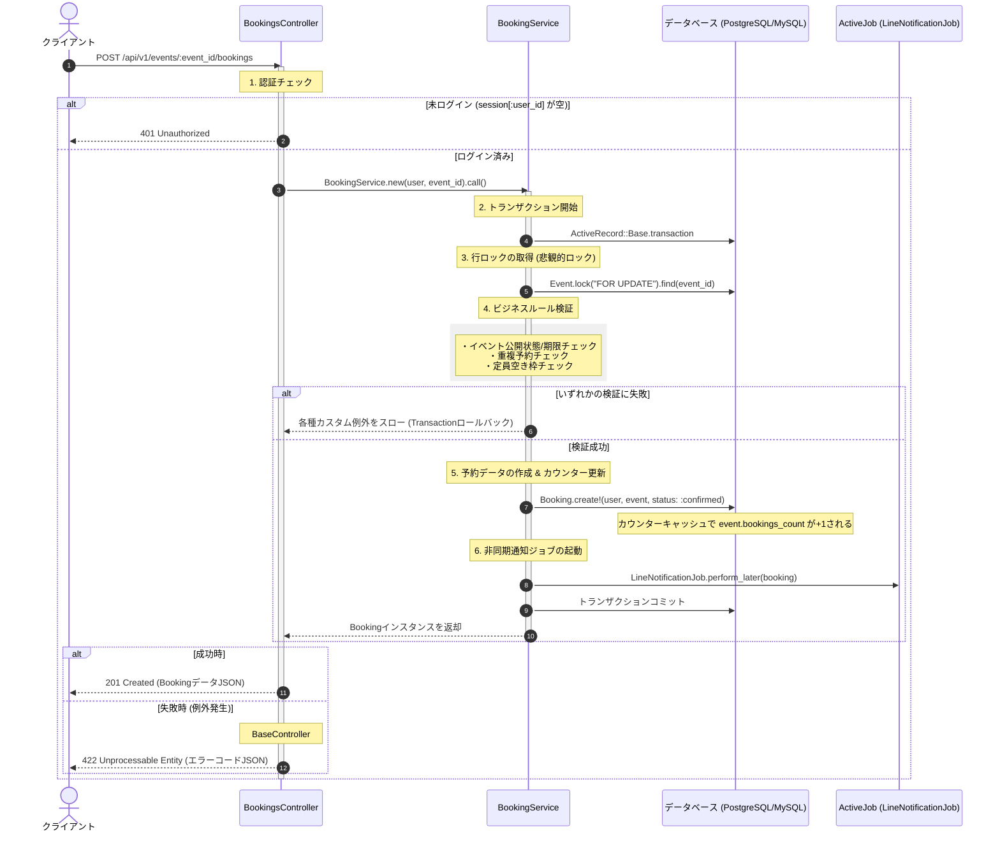

# 予約処理 詳細設計書 (Booking)

予約処理（外部APIからの予約リクエスト受付からデータベース保存、外部システム連携まで）の具体的な実装仕様を定義した詳細設計（内部設計）です。

---

## 1. 処理フローに沿った詳細仕様

リクエストの受信からレスポンス返却にいたるまでの時系列フローに沿って、各コンポーネントの処理詳細を定義します。



---

## 2. 各工程の具体的な実装設計

上記の時系列フローに対応する、具体的なクラスやDBの設定詳細です。

### 1. 認証チェック (工程 1)
*   `BookingsController` は `Api::V1::BaseController` を継承し、前処理でセッションから `current_user` が取得できることを保証します。取得できない場合は `401` レスポンスを返して処理を中断します。

### 2. トランザクションと行ロックの取得 (工程 2, 3)
同時アクセス発生時のデータ整合性を保証するため、`BookingService` の内部で以下のように行ロックを取得します。
```ruby
# app/services/booking_service.rb
class BookingService
  def initialize(user, event_id)
    @user = user
    @event_id = event_id
  end

  def call
    ActiveRecord::Base.transaction do
      # イベントレコードを明示的に行ロック (FOR UPDATE)
      event = Event.lock("FOR UPDATE").find(@event_id)
      
      # ビジネスルールチェックを実行
      validate_booking!(event)
      
      # 予約の作成
      booking = Booking.create!(user: @user, event: event, status: :confirmed)
      
      # トランザクション成功時にLINE通知をキューに積む
      LineNotificationJob.perform_later(booking.id)
      
      booking
    end
  end
  
  private
  
  def validate_booking!(event)
    # 3. ビジネスルール検証 (工程 4) の中身
  end
end
```

### 3. ビジネスルール検証と例外定義 (工程 4)
検証エラーが発生した場合は、トランザクションをロールバックさせるためにカスタム例外を発生させます。

#### カスタム例外クラス (`app/errors/booking_error.rb`)
*   `BookingError` (StandardErrorを継承)
    *   `EventClosedError`: イベント非公開、または開催日時が過去のとき。
    *   `DuplicateBookingError`: 既に同一イベントの予約があるとき。
    *   `CapacityExceededError`: 現在の予約数が定員に達しているとき。

#### 検証ロジック
```ruby
def validate_booking!(event)
  # 1. イベント状態チェック
  unless event.published? && event.held_at > Time.current
    raise EventClosedError, "このイベントは予約受付を終了しています。"
  end
  
  # 2. 重複予約チェック
  if Booking.exists?(user: @user, event: event)
    raise DuplicateBookingError, "既にこのイベントは予約済みです。"
  end
  
  # 3. 定員チェック (カウンターキャッシュを使用)
  if event.bookings_count >= event.capacity
    raise CapacityExceededError, "定員に達したため、予約できません。"
  end
end
```

### 4. データベースの物理整合性 (工程 5)
アプリケーションロジックのすり抜けやバグに備え、データベースレベルでも制約をかけます。
*   **物理ユニーク制約**: `bookings` テーブルに `user_id` と `event_id` の複合ユニークインデックスを設定します。これにより、万が一重複検証がすり抜けてもDB側で登録を弾きます。
    `add_index :bookings, [:user_id, :event_id], unique: true`
*   **カウンターキャッシュの適用**: `Booking` モデルに `counter_cache: true` を定義し、`events` テーブルの `bookings_count` を自動的にインクリメントします。
    `belongs_to :event, counter_cache: true`

### 5. レスポンス返却とグローバル例外捕捉 (工程 6)
`Api::V1::BaseController` で `rescue_from` を設定し、`BookingService` 内で発生したカスタム例外をキャッチして適切なレスポンスに変換します。

```ruby
class Api::V1::BaseController < ApplicationController
  rescue_from BookingError, with: :handle_booking_error

  private

  def handle_booking_error(exception)
    code = case exception
           when EventClosedError then :event_closed
           when DuplicateBookingError then :duplicate_booking
           when CapacityExceededError then :capacity_exceeded
           else :booking_failed
           end

    render json: {
      status: "error",
      code: code,
      message: exception.message
    }, status: :unprocessable_entity
  end
end
```

