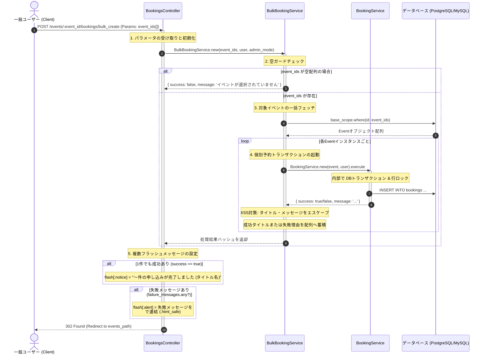

# 複数イベント一括予約処理 詳細設計書

複数のイベントに対する一括予約処理の具体的な実装仕様を定義した詳細設計（内部設計）です。

---

## 1. 処理フローに沿った詳細仕様

リクエストの受信からレスポンス返却にいたるまでの時系列フローに沿って、各コンポーネントの処理詳細を定義します。



---

## 2. 各工程 of 具体的な実装設計

上記の時系列フローに対応する、具体的なクラスやDBの設定詳細です。

### 1. API (エンドポイント) 仕様 (工程 1)
*   **URL**: `/events/:event_id/bookings/bulk_create` (※ `resources :bookings` の `bulk_create` アクションにルーティング)
*   **HTTP Method**: `POST`
*   **リクエストパラメータ**:
    *   `event_ids[]` (Array of Integer, 必須): 一括で予約を申し込む対象のイベントID配列
*   **レスポンス**:
    *   `302 Found` (イベント一覧 `events_path` へのリダイレクト)

### 2. トランザクション設計と部分成功の許容 (工程 4)
*   **トランザクション境界**:
    本一括予約は「一部のイベントの予約が失敗しても、成功した予約はそのまま成立させる」というポリシーを採用しています。
    そのため、`BulkBookingService` 全体を1つのトランザクションで囲うことはせず、ループ内で呼び出される個別 `BookingService.new` の中でそれぞれトランザクション（および悲観的行ロック `FOR UPDATE`）が実行されます。
*   これによって、例えば「イベントA」が並行処理によりタッチの差で定員超過して予約失敗しても、「イベントB」の予約が正常であればイベントBの予約コミットは正常に完了します。

### 3. XSS（クロスサイトスクリプティング）対策 (工程 4, 5)
一括エラー通知において、コントローラーは失敗メッセージ（配列）をHTML改行タグ（`<br>`）で結合して画面に表示するため、`.html_safe` フィルタを適用します。この際、ユーザー入力に起因するXSSの脆弱性を防ぐため、サービス層で以下のエスケープ処理を強制します。

*   **処理**: `BulkBookingService` の内部で、イベントタイトル (`event.title`) および個別のエラー文言 (`result[:message]`) を事前に `ERB::Util.html_escape` でエスケープした上で蓄積します。
*   これによって、コントローラー側で `html_safe` を呼び出しても、挿入される値は安全な文字列のみとなり、悪意あるスクリプトの実行を防止できます。

### 4. コントローラー制御ロジック (工程 5)
コントローラーはサービスの処理結果をパースし、通知メッセージを設定してリダイレクトします。

```ruby
# app/controllers/bookings_controller.rb
def bulk_create
  result = BulkBookingService.new(params[:event_ids] || [], current_user, admin_mode: admin_signed_in?).execute

  # 1つでも成功があればグリーン通知を設定
  if result[:success]
    flash[:notice] = I18n.t("views.bookings.bulk_create.success_with_count", 
                            count: result[:success_count], 
                            titles: result[:success_titles].join(I18n.t("common.punctuation.comma")))
  end

  # 失敗があれば個別行でレッドアラートを設定 (html_safe)
  if result[:failure_messages].any?
    flash[:alert] = result[:failure_messages].join("<br>").html_safe
  end

  redirect_to events_path
end
```
