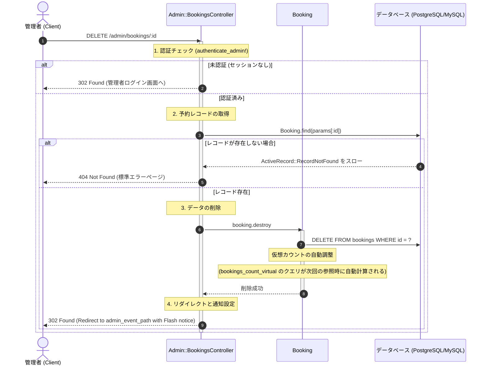

# 予約キャンセル処理 (管理者) 詳細設計書

管理者による予約キャンセル処理の具体的な実装仕様を定義した詳細設計（内部設計）です。

---

## 1. 処理フローに沿った詳細仕様

リクエストの受信からレスポンス返却にいたるまでの時系列フローに沿って、各コンポーネントの処理詳細を定義します。



---

## 2. 各工程の具体的な実装設計

上記の時系列フローに対応する、具体的なクラスやDBの設定詳細です。

### 1. 認証・前提条件チェック仕様 (工程 1)
*   `Admin::BookingsController` は `Admin::BaseController` を継承します。
*   `Admin::BaseController` 内の `before_action :authenticate_admin!` フィルタにより、リクエストを送信したユーザーが管理者セッションを保持していることを保証します。未認証時は自動的に管理者ログイン画面へリダイレクトされます。

### 2. API (エンドポイント) 仕様 (工程 1)
*   **URL**: `/admin/bookings/:id`
*   **HTTP Method**: `DELETE`
*   **パスパラメータ**:
    *   `id` (Integer, 必須): 削除対象となる予約データのID
*   **レスポンス**:
    *   成功時: `302 Found` (イベント詳細画面 `admin_event_path(event)` へのリダイレクト)
    *   レコード未存在時: `404 Not Found` (標準エラー画面)

### 3. クラス・コンポーネント設計 (工程 2, 3)
本処理は複雑なビジネスロジックを含まない単一レコードの物理削除であるため、Service Object を介さずコントローラーが直接モデルを制御する Skinny Controller 構成となっています。

```ruby
# app/controllers/admin/bookings_controller.rb
class Admin::BookingsController < Admin::BaseController
  def destroy
    # 2. 予約レコードの取得
    @booking = Booking.find(params[:id])
    @event = @booking.event
    @user = @booking.user

    # 3. データの削除 (依存するアソシエーションやトリガーは特になし)
    @booking.destroy

    # 4. リダイレクトと通知設定
    redirect_to admin_event_path(@event), notice: t("admin.notices.booking_cancelled", name: @user.name || @user.email)
  end
end
```

### 4. データベース物理整合性 (工程 3)
*   **物理削除**: `bookings` テーブルから該当の行を物理削除します。
*   **外部キー・関連データ処理**: 
    *   `Event` モデル側で `has_many :bookings, dependent: :destroy` が定義されているため、イベント削除時には予約が連動して削除されますが、予約単体の削除時にはイベントレコードは影響を受けません。
*   **予約可能枠カウント（仮想）**:
    *   本システムではデータベースの物理的な `bookings_count` カウンターキャッシュを使用せず、`Event` モデルの `bookings_count_virtual` スコープでSQLサブクエリによる集計を行っています。
    *   そのため、予約データが削除された時点で、次回以降のイベント情報取得時に評価される予約数カウントは自動的に減算された状態となります。

### 5. 例外・エラーハンドリング設計 (工程 2)
*   `Booking.find(params[:id])` の呼び出し時にレコードが存在しない場合、Railsは `ActiveRecord::RecordNotFound` 例外をスローします。
*   本コントローラーでは個別で rescue 処理は行わず、Rails標準の例外ハンドラーに処理を委譲することで、クライアントに対して `404 Not Found` の標準エラーページを返却します。
