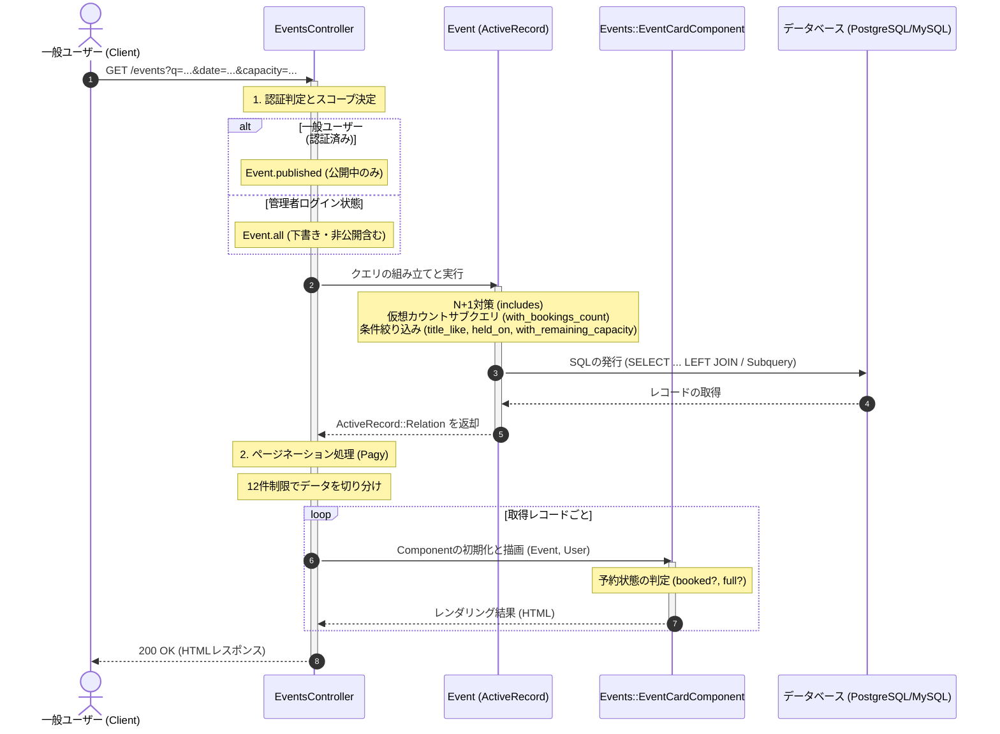

# イベント一覧表示処理 詳細設計書

公開中イベント一覧表示および検索処理の具体的な実装仕様を定義した詳細設計（内部設計）です。

---

## 1. 処理フローに沿った詳細仕様

リクエストの受信からレスポンス返却にいたるまでの時系列フローに沿って、各コンポーネントの処理詳細を定義します。



---

## 2. 各工程の具体的な実装設計

上記の時系列フローに対応する、具体的なクラスやDBの設定詳細です。

### 1. 認証とスコープ分岐 (工程 1)
*   **認証フィルター**: 一般ユーザーの場合 `before_action :authenticate_user!` が作動し、未ログイン時はログイン画面へ戻されます。管理者がログインしている場合はこれがスキップされます。
*   **スコープ選択**: `admin_signed_in?` に基づき、下書きや非公開イベントを表示するか（`Event.all`）、公開イベントのみにするか（`Event.published`）のベースクエリを決定します。

### 2. 絞り込みクエリとN+1対策 (工程 1)
イベント一覧の取得では、以下のActiveRecordスコープとアソシエーションのプリロード（N+1対策）を組み合わせて高速なデータ取得を実現します。

```ruby
# app/controllers/events_controller.rb より抜粋
base_scope = admin_signed_in? ? Event.all : Event.published
@events = base_scope.includes(:event_type) # N+1防止
               .with_bookings_count # 予約数のサブクエリ
               .title_like(params[:q]) # タイトル部分一致
               .held_on(params[:date]) # 開催日一致
               .with_remaining_capacity(params[:capacity]) # 最低空き枠数
               .order(held_at: :asc)
```

#### 各スコープの実装詳細 (`app/models/event.rb`)
*   **`with_bookings_count`**: 
    予約テーブルへの個別カウント発行を避けるため、SELECT句の中でサブクエリを実行し仮想的な予約数フィールドをロードします。
    `select("events.*, (SELECT COUNT(*) FROM bookings WHERE bookings.event_id = events.id) AS bookings_count_virtual")`
*   **`title_like(q)`**: タイトルのあいまい検索。
    `where("title LIKE ?", "%#{q}%") if q.present?`
*   **`held_on(date)`**: 指定日付の終日に開催されるイベントを検索。タイムゾーンに対応。
    `where(held_at: Time.zone.parse(date).all_day) if date.present?`
*   **`with_remaining_capacity(n)`**:
    定員数から予約数（仮想カウント）を引いた残余枠数が指定数以上のイベントを、SQLレベルで絞り込みます。
    `where("events.capacity - (SELECT COUNT(*) FROM bookings WHERE bookings.event_id = events.id) >= ?", n.to_i) if n.present?`

### 3. ページネーション仕様 (工程 2)
*   **使用ライブラリ**: Pagy
*   **設定数**: 1ページあたり `12` 件。
*   `@pagy, @events = pagy(@events, limit: 12)`
*   ビューでは `@pagy.series_nav` を用いてプレミアムなページネーションリンクをレンダリングします。

### 4. ビューコンポーネント設計 (工程 3)
各イベントカードはカプセル化された `Events::EventCardComponent` を使用して描画されます。

*   **コンポーネントクラス**: `app/components/events/event_card_component.rb`
*   **状態の動的解決**:
    *   `booked?`: ログイン中のユーザーがすでに該当イベントを予約済みか。
        `event.booked_by?(current_user)` (内部で `exists?` クエリを発行)
    *   `full?`: 該当イベントが定員に達しているか。
        `event.current_bookings_count >= event.capacity` (内部で仮想カウント `bookings_count_virtual` を優先使用)
    *   `disabled?`: 選択対象外（すでに予約済み、または満席）か。
        `booked? || full?`
*   **一括予約チェックボックス**:
    *   `disabled?` のイベントはチェックボックスが非活性（`disabled`）になります。
    *   JavaScript (Stimulus) `bulk-booking` コントローラーと紐づいており、チェックボックスの状態変化をトリガーに一括予約フローティングバーの表示とチェック件数ラベルが同期します。
