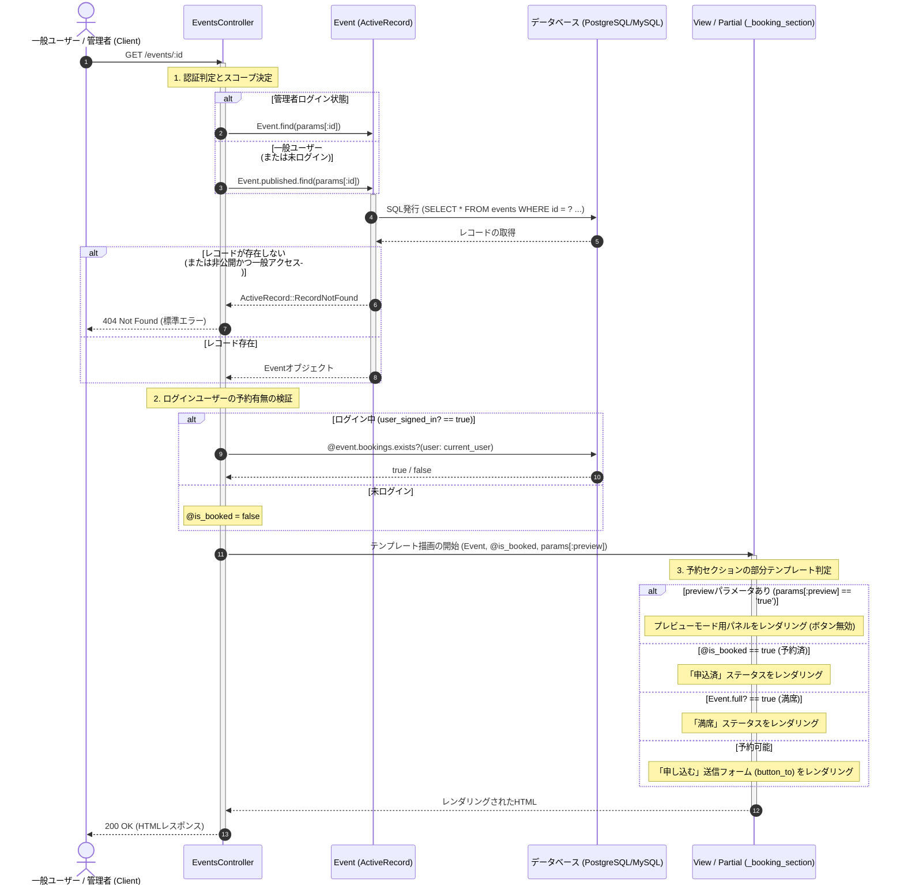

# イベント詳細表示処理 詳細設計書

特定イベント詳細情報表示および予約ステータス判定処理の具体的な実装仕様を定義した詳細設計（内部設計）です。

---

## 1. 処理フローに沿った詳細仕様

リクエストの受信からレスポンス返却にいたるまでの時系列フローに沿って、各コンポーネントの処理詳細を定義します。



---

## 2. 各工程の具体的な実装設計

上記の時系列フローに対応する、具体的なクラスやモデルの設定詳細です。

### 1. レコード取得と権限チェック (工程 1)
*   **認証フィルター**: 一般ユーザーの場合 `before_action :authenticate_user!` が作動し、未ログイン時はログイン画面へ戻されます。管理者がログインしている場合はこれがスキップされます。
*   **ロールベースの検索範囲**:
    *   一般ユーザーは非公開イベントにアクセスできないよう、公開中のスコープから検索します：
        `Event.published.find(params[:id])`
    *   管理者はプレビューや編集のために、公開ステータスに関わらず検索可能です：
        `Event.find(params[:id])`
*   **例外**: 該当イベントが見つからない、または公開状態にないイベントに一般ユーザーがアクセスした場合は `ActiveRecord::RecordNotFound` 例外がスローされ、Rails標準の404エラー画面が表示されます。

### 2. 予約存在チェック (工程 2)
データベースに予約状況を問い合わせるクエリを発行し、その結果をビューの判定フラグに代入します。
*   `@is_booked = user_signed_in? && @event.bookings.exists?(user: current_user)`
*   `exists?` を使用することで、テーブルから全レコードを読み込まず、1行のレコードが存在するかどうかだけの軽量なクエリ（`SELECT 1 AS one ... LIMIT 1`）を発行して判定を高速化します。

### 3. 部分テンプレート `_booking_section.html.erb` の状態制御 (工程 3)
サイドバーに表示されるアクションエリアは、渡されたパラメータとモデルの状態値に基づいて、以下のように表示を切り替えます。

```ruby
# app/views/bookings/_booking_section.html.erb の条件フロー
if params[:preview] == "true"
  # 管理者プレビューモード
  # 申し込みボタンは半透明でクリックできない状態にする
elsif is_booked
  # ログイン中ユーザーがすでに申し込んでいる場合
  # 「申込済」のチェックバッジを表示
elsif event.full?
  # 定員に達している場合 (event.full?)
  # 「満席」バッジを表示
else
  # 予約が可能な場合
  # 送信先: event_bookings_path(event) (POST) のボタンを表示
end
```

*   **定員充足度判定 (`event.full?`)**:
    `Event` モデルの `current_bookings_count >= capacity` を評価します。N+1が発生しないよう、仮想カウントが利用可能であればそれを優先します。
*   **予約ボタンのアクション**:
    *   `button_to` により、`POST /events/:event_id/bookings` へリクエストを送信するフォームタグを生成します。
    *   送信確認のために `data: { turbo_confirm: t('events.show.confirm_apply') }` を付加し、ブラウザ上で確認ポップアップを表示します。
