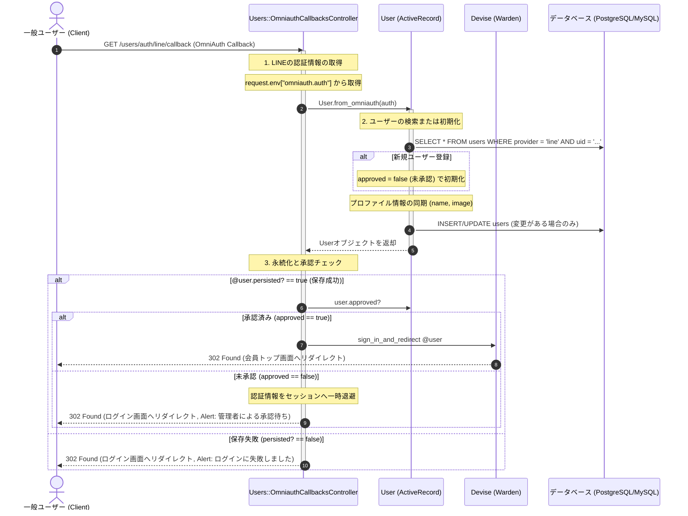

# LINEログイン認証処理 詳細設計書

LINEログイン（Devise / OmniAuth LINE）を用いた認証処理および自動会員登録の具体的な実装仕様を定義した詳細設計（内部設計）です。

---

## 1. 処理フローに沿った詳細仕様

リクエストの受信からレスポンス返却にいたるまでの時系列フローに沿って、各コンポーネントの処理詳細を定義します。



---

## 2. 各工程の具体的な実装設計

上記の時系列フローに対応する、具体的なクラスやモデルの設定詳細です。

### 1. Devise・OmniAuth設定
本システムは Devise を使用して LINE OAuth 認証を制御します。
*   **ルーティング**: `config/routes.rb`
    `devise_for :users, controllers: { omniauth_callbacks: "users/omniauth_callbacks" }`
*   **認証設定**: `app/models/user.rb`
    `devise :omniauthable, omniauth_providers: [ :line ]`

### 2. ユーザー検索・作成ロジック (工程 2)
OAuthで取得したUID情報をキーにして、ローカルデータベース内のユーザーを検索または初期化します。
*   **メソッド**: `User.from_omniauth(auth)`
*   **初期化設定**: 新規登録されたユーザーは即座にログインできないよう、`approved` カラムを `false`（未承認）で登録します。
*   **プロファイル同期**: LINE側でプロフィール名や画像が変更された場合、ログインの都度それを検知し自動的に同期更新します。

```ruby
# app/models/user.rb
def self.from_omniauth(auth)
  user = where(provider: auth.provider, uid: auth.uid).first_or_initialize do |u|
    u.approved = false # 新規登録時は未承認
  end

  user.name = auth.info.name
  user.image = auth.info.image
  user.save if user.changed?
  user
end
```

### 3. Devise認証フックと未承認ユーザーのログイン拒否 (工程 3)
Devise（内部的にはWarden）のフックをオーバーライドし、データベース上で `approved: false` のユーザーのサインインをブロックします。

*   **フックメソッド 1**: `active_for_authentication?`
    `super && approved?` を満たす場合のみ認証成功とみなします。
*   **フックメソッド 2**: `inactive_message`
    ログイン拒否時に表示するエラーメッセージのキーを返します。ここでは I18n 翻訳ファイルと連動する `:not_approved` を返します。

```ruby
# app/models/user.rb
def active_for_authentication?
  super && approved?
end

def inactive_message
  approved? ? super : :not_approved
end
```

### 4. コールバックコントローラーの制御 (工程 3)
LINEログイン完了後のコールバックを処理し、認証結果と承認状態に応じてレスポンスを制御します。

```ruby
# app/controllers/users/omniauth_callbacks_controller.rb
class Users::OmniauthCallbacksController < Devise::OmniauthCallbacksController
  def line
    @user = User.from_omniauth(request.env["omniauth.auth"])

    if @user.persisted?
      if @user.approved?
        # 承認済み：ログイン完了しリダイレクト
        sign_in_and_redirect @user, event: :authentication
        set_flash_message(:notice, :success, kind: "LINE") if is_navigational_format?
      else
        # 未承認：ログインさせず、メッセージを表示して差し戻す
        session["devise.line_data"] = request.env["omniauth.auth"].except(:extra)
        redirect_to new_user_session_path, alert: "管理者による承認待ちです。"
      end
    else
      # 保存失敗
      session["devise.line_data"] = request.env["omniauth.auth"].except(:extra)
      redirect_to new_user_session_path, alert: "ログインに失敗しました。"
    end
  end

  def failure
    set_flash_message(:alert, :failure, kind: "LINE", reason: failure_message) if is_navigational_format?
    redirect_to new_user_session_path
  end
end
```

### 5. データベース物理設計
*   **テーブル**: `users`
*   **一意性制約**: 同一のLINEアカウントが二重に登録されないよう、物理キーとして一意インデックスを付与します。
    `add_index :users, [:provider, :uid], unique: true`
*   **フラグカラム**: 承認状態を表現するため、デフォルトが `false` である論理型カラム `approved` を定義します。
    `t.boolean :approved, default: false, null: false`
