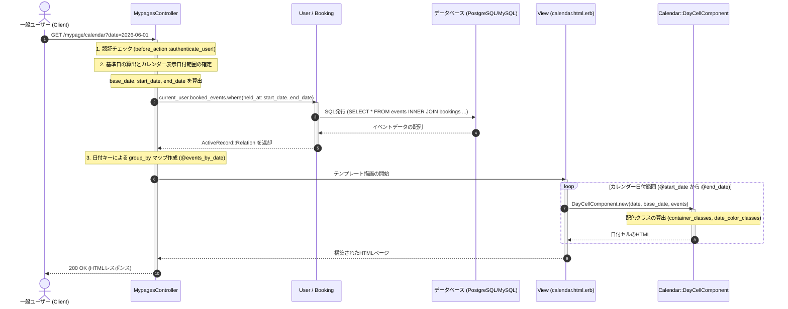

# 予約カレンダーマイページ 詳細設計書

自身の予約カレンダー表示処理の具体的な実装仕様を定義した詳細設計（内部設計）です。

---

## 1. 処理フローに沿った詳細仕様

リクエストの受信からレスポンス返却にいたるまでの時系列フローに沿って、各コンポーネントの処理詳細を定義します。



---

## 2. 各工程の具体的な実装設計

上記の時系列フローに対応する、具体的なクラスやDBの設定詳細です。

### 1. ログイン認証と日付範囲算出 (工程 1, 2)
*   **認証**: `before_action :authenticate_user!` により、一般ユーザーセッションがない場合はログイン画面へリダイレクトされます。
*   **基準日 (`@base_date`)**: 
    URLパラメータ `params[:date]` を受け取り、日付型にキャストします。パラメータがない場合は、実行時のシステム日付（`Date.today`）を適用します。
*   **カレンダー表示期間の算出**:
    Railsの `ActiveSupport` 拡張メソッドを用いて、カレンダーの日曜日始まりから土曜日終わりまでの矩形範囲を正確に算出します。

```ruby
# app/controllers/mypages_controller.rb
@base_date = params[:date]&.to_date || Date.today
@start_date = @base_date.beginning_of_month.beginning_of_week(:sunday)
@end_date = @base_date.end_of_month.end_of_week(:sunday)
```

### 2. データ取得とメモリ内マッピング (工程 3)
*   **データ取得範囲**: 
    前月末や翌月頭の「はみ出し期間」に開催される予約済みイベントもカレンダーセル上に描画するため、上記で算出した表示範囲全体を時間指定（最終日は 23:59:59 まで）で絞り込みます。
    `current_user.booked_events.where(held_at: @start_date..@end_date.end_of_day)`
*   **メモリ内 `group_by` マップ**:
    ビューのループ内で毎日個別のSQLクエリ（N+1問題）が発生するのを防ぐため、あらかじめ `group_by` を用いて、Rubyメモリ内で「日付（`Date`） => イベント配列（`Array`）」のハッシュマップを作成します。
    `@events_by_date = @booked_events.group_by { |e| e.held_at.to_date }`

### 3. 日付セルの配色ロジック (`Calendar::DayCellComponent`) (工程 3)
ビュー側で日付ループを行い、各日付セルを描画するコンポーネントにおいて、以下の論理ルールに基づきHTMLクラスを決定します。

*   **コンテナー背景クラス (`container_classes`)**:
    *   当月以外: `bg-gray-50/20` (半透明グレー)
    *   当月かつ予約あり: `bg-indigo-50/40 ring-1 ring-inset ring-indigo-500/10 hover:bg-indigo-100/60 hover:shadow-lg`
    *   当月かつ予約なし: `bg-white`
*   **日付文字クラス (`date_color_classes`)**:
    *   今日 (`date == Date.today`): `bg-indigo-600 text-white shadow-lg`
    *   日曜日: 当月なら `text-pink-500`、他月なら `text-pink-200`
    *   土曜日: 当月なら `text-indigo-500`、他月なら `text-indigo-200`
    *   平日: 当月なら `text-gray-900`、他月なら `text-gray-300`

### 4. モバイル・デスクトップ別レイアウト分岐
*   **PCサイズ（幅768px以上）**:
    各セルの内部に、日付に関連付けられた `events` の各タイトルを `a` リンク付きタグ（`bg-indigo-50 text-indigo-700`）として一覧表示します。
*   **スマホサイズ（幅768px未満）**:
    各セル内部には青い小さな点（`w-1.5 h-1.5 rounded-full bg-indigo-500`）のみをプレースホルダーとして描画し、カレンダー下部に `booked_events` から当月に該当するものを抽出・ソートして一覧リスト化します。
    `@booked_events.filter { |e| e.held_at.month == @base_date.month }.sort_by(&:held_at)`
